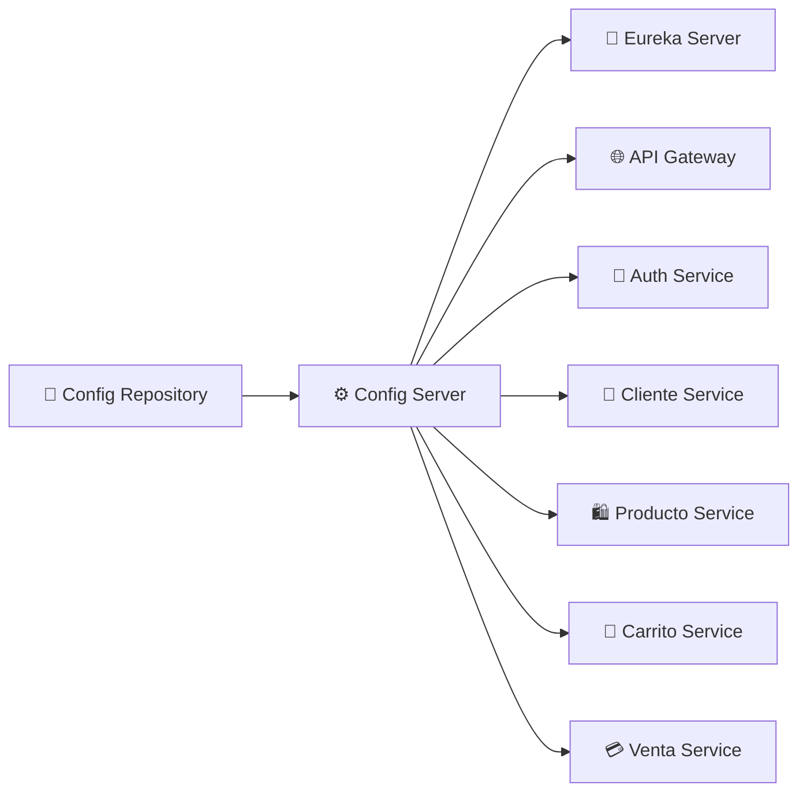

<div align="center">

# ⚙️ Config Server

### Configuración centralizada para el ecosistema ElectrodoStore
#### Spring Cloud Config · Git Backend · Spring Boot


</div>

---

Servidor de configuración centralizada para el ecosistema de microservicios de **ElectrodoStore**, basado en **Spring Cloud Config Server**.

Todos los microservicios obtienen su configuración desde este servidor al momento de iniciar, eliminando la necesidad de gestionar archivos de configuración de forma individual en cada servicio.

---

## 🎯 Responsabilidades

- ⚙️ Centralizar la configuración de los microservicios
- 📂 Servir propiedades desde un repositorio Git
- 🔄 Versionar configuraciones junto al código
- 🔒 Externalizar configuraciones sensibles
- 🌐 Unificar la gestión de configuración del ecosistema

---

## 🧰 Tecnologías utilizadas


---

## 🔄 ¿Cómo funciona?

El Config Server lee las configuraciones directamente desde el **config-repo** (repositorio GitHub) y las sirve a cada microservicio en el momento de su arranque.

```
Microservicio → Config Server → config-repo
```

Esto permite:

- Cambiar configuraciones sin recompilar ni redesplegar servicios
- Centralizar variables de entorno y propiedades
- Versionar la configuración junto al código

---

## 🏗️ Arquitectura



---

## 🗂️ Repositorio de configuraciones

Las configuraciones de todos los servicios están alojadas en **GitHub** → [config-repo](https://github.com/electrodostore/electrodostore-config-server-repo)

| Propiedad | Valor |
| --- | --- |
| Visibilidad | ✅ Público |
| Credenciales | 🔒 Externalizadas mediante variables de entorno |

---

## 🔌 Configuración de red

| Propiedad | Valor |
| --- | --- |
| Puerto | `8888` |
| Acceso | 🔒 Solo interno — consumido por los microservicios |

---

## ⚠️ Variables de entorno requeridas

| Variable | Descripción |
| --- | --- |
| `GITHUB_URL` | URL del repositorio de configuraciones |
| `GITHUB_USERNAME` | Usuario de GitHub |
| `GITHUB_TOKEN` | Token de acceso a GitHub |
| `PORT` | Puerto del servidor (por defecto `8888`) |

---

## ▶️ Ejecución local

> ⚠️ Este servicio debe iniciarse **antes que cualquier otro microservicio**, ya que todos dependen de él para obtener su configuración.

### Maven

```bash
mvn spring-boot:run
```

### Docker

```bash
docker build -t config-server .
```

---

## 💡 Decisiones de diseño

<details>
<summary><b>📂 Configuración versionada en Git</b></summary>
<br>
Todas las configuraciones se almacenan en un repositorio Git independiente, permitiendo trazabilidad y control de cambios.
</details>

<details>
<summary><b>⚙️ Configuración centralizada</b></summary>
<br>
Los microservicios obtienen su configuración desde una única fuente de verdad, reduciendo duplicidad y errores de sincronización.
</details>

<details>
<summary><b>🔒 Credenciales externalizadas</b></summary>
<br>
Las credenciales de acceso al repositorio se gestionan mediante variables de entorno y no forman parte del código fuente.
</details>

<details>
<summary><b>🧩 Separación entre configuración y lógica de negocio</b></summary>
<br>
La configuración se mantiene desacoplada de los microservicios, permitiendo modificar parámetros operativos sin alterar el código de las aplicaciones.
</details>

---

## 🚀 Mejoras futuras

| Mejora | Descripción |
| --- | --- |
| 🔑 **Cifrado de propiedades** | Cifrado de valores sensibles con Spring Cloud Config encryption |
| 🔄 **Refresh automático** | Actualización de configuración sin reiniciar servicios (`@RefreshScope`) |
| 📊 **Monitoreo** | Supervisión del estado del servidor |
| 🚌 **Spring Cloud Bus** | Propagación distribuida de cambios de configuración |

